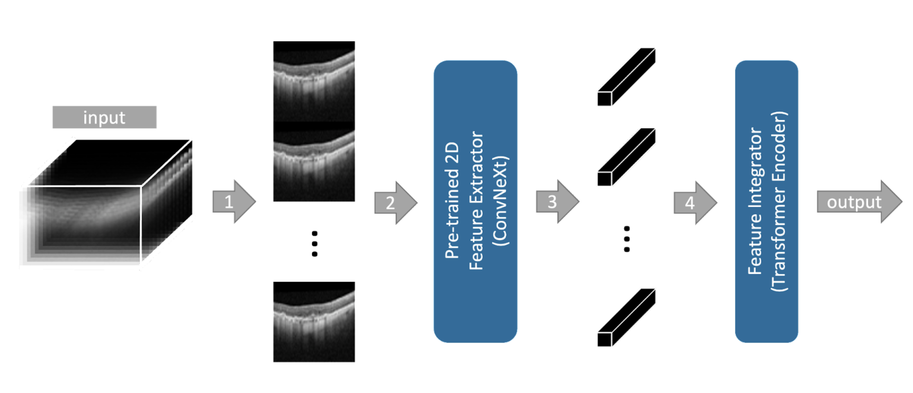

# SLIViT: a general AI framework for clinical-feature diagnosis from limited 3D biomedical-imaging data





SLIViT is a deep-learning framework that accurately measures disease-related risk factors in volumetric biomedical imaging, such as magnetic resonance imaging (MRI) scans, optical coherence tomography (OCT) scans, ultrasound videos, and Computed Tomography (CT) scans (for further details please refer to <a href="https://www.researchsquare.com/article/rs-3044914/latest">our manuscript</a>). 

Before running SLIViT.ipynb, please make sure to have an appropriate Python environment with the relevant packages (listed in requirements.txt) properly installed:
```bash
conda create --name slivit --file requirements.txt
```

A pre-trained backbone is provided (see backbone.pth.zip) although one may wish to train the model from scratch.

A code snippet with an example of loading a pre-trained SLIViT model and running inference on a given volume is provided at the end of the SLIViT.ipynb notebook.

# ConvNeXt Backbone Pre-Training
To commence pre-training with 2D Medical Scans, split the data into `train`, `validation`, `test` sets. Create three folders named `train`, `val`, `test`, and move the scans accordingly.

Generate the  ```meta.csv``` file for 2D pre-training data as illustrated below:

|F_Name | Path | Drusen  |  DME   |  CNV  | Normal  | 
|--- | --- | --- | --- |--- |--- |
| CNV-6116901-21.jpeg  | /data_dir/train/CNV/CNV-6116901-21.jpeg| 1.0 | 0.0   |  0.0  |   0.0| 
| DME-4616882-33.jpeg  |   /data_dir/test/DME/DME-4616882-33.jpeg| 0.0 | 1.0  |   0.0   |  0.0| 
| CNV-7907754-23.jpeg  |  /data_dir/test/CNV/CNV-7907754-23.jpeg | 1.0 | 0.0   |  0.0    | 0.0| 
| NORMAL-3757443-31.jpeg | /data_dir/val/NORMAL/NORMAL-3757443-31.jpeg | 0.0  |0.0  |   0.0   |  1.0
| NORMAL-6434323-2.jpeg |  /data_dir/train/NORMAL/NORMAL-6434323-2.jpeg  |0.0|  0.0   |  0.0 |    1.0|
| NORMAL-910422-8.jpeg | /data_dir/val/NORMAL/NORMAL-910422-8.jpeg | 0.0 | 0.0  |   0.0   |  1.0|
| DRUSEN-8086850-28.jpeg | /data_dir/train/DRUSEN/DRUSEN-8086850-28.jpeg | 0.0 | 0.0   |  1.0   |  0.0|

In the above table, `F_Name` denotes the file name for 2D medical scan files, `Path` indicates the directory to these files, and `Drusen`, `DME`, `CNV`, and `Normal` represent binary classes for the respective pathologies.

After creating ```meta.csv``` file, ConvNeXt backbone can be trained with following bash script:

```bash
python bb_train.py --meta_csv /path/to/meta.csv --pathologies CNV,Drusen,DME,Normal --out_dir /output/dir/to/save_pretrained_model/ --b_size 4 --gpu_id 1 --n_cpu=32
```
- ```--meta_csv``` is the directory to the created ```meta.csv```.
- ```--pathologies``` is a comma-separated list of pathologies for pre-training.
- ```--out_dir```  is the output directory for saving the pre-trained backbone.
- ```--b_size``` denotes the batch size for training.
- ```--out_dir``` pecifies the GPU ID for training.
- ```--n_cpu``` indicates the number of CPUs for data loading.


Feel free to <a href="mailto:orenavram@gmail.com,berkin1997@g.ucla.edu?subject=A%20SLIViT%20question"> reach out</a> regarding any concerns/issues you are experiencing with SLIViT.

# Acknowledgements
Parts of the code are taken from the <a href="https://github.com/lucidrains/vit-pytorch/tree/main"> vit-pytorch</a> repository.
