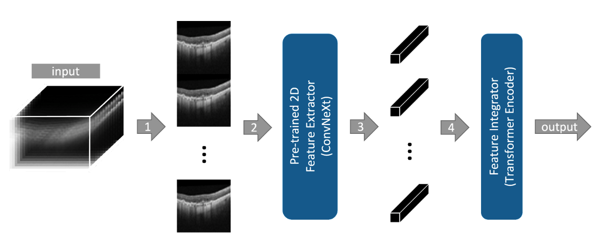

# SLIViT: a general AI framework for medical-feature diagnosis from limited 3D biomedical-imaging data





SLIViT is a deep-learning framework that accurately measures disease-related risk factors in volumetric biomedical imaging, such as magnetic resonance imaging (MRI) scans, optical coherence tomography (OCT) scans, and ultrasound videos. 

Before running SLIViT.ipynb, please make sure to have an appropriate Python environment with the relevant packages (listed in requirements.txt) properly installed:
```bash
conda create --name slivit -c conda-forge -c bioconda --file requirements.txt
```

A pre-trained backbone is provided (see backbone.pth.zip) although one may wish to train the model from scratch.

A code snippet with an example of loading a pre-trained SLIViT model and running inference on a given volume is provided at the end of the SLIViT.ipynb notebook.

Feel free to <a href="mailto:orenavram@gmail.com,berkin1997@g.ucla.edu?subject=A%20SLIViT%20question"> reach out</a> regarding any concerns/issues you are experiencing with SLIViT.
