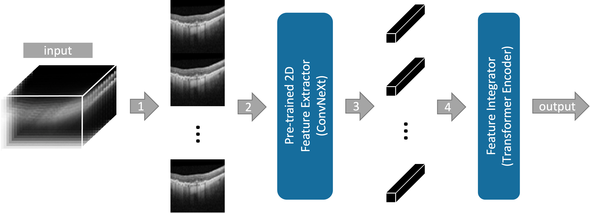

# SLIViT: a general AI framework for medical-feature diagnosis from limited 3D biomedical-imaging data

SLIViT is a deep-learning framework that accurately measures disease-related risk factors in volumetric biomedical imaging, such as magnetic resonance imaging (MRI) scans, optical coherence tomography (OCT) scans, and ultrasound videos. 

Please make sure first to install all the relevant packages listed in requirements.txt in order to be able to use SLIViT.

A pre-trained backbone is also provided (see backbone.pth.zip) although one may wish to train the model from scratch.

A code snippet with an example of how to load a pre-trained SLIViT model and run inference on a given volume is provided at the end of the Jupyter Notebook (see SLIViT.ipynb).

