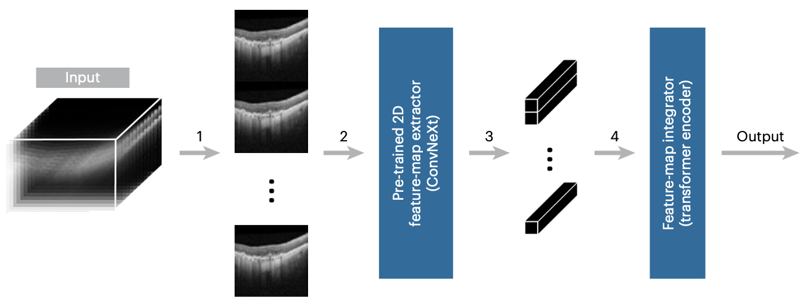
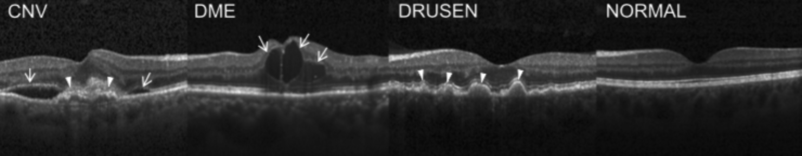
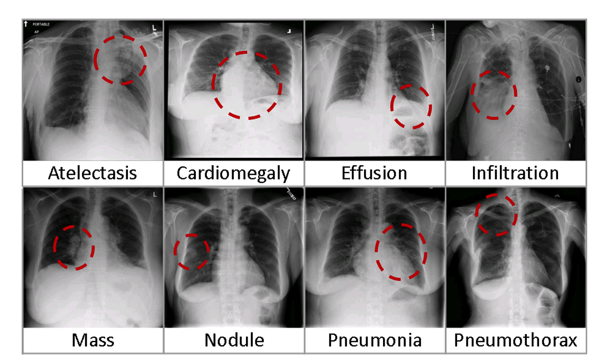
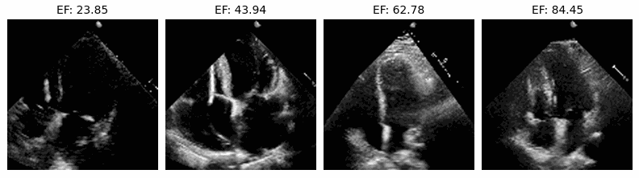
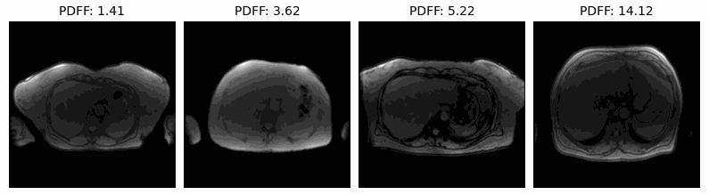

<div style="text-align: justify">

<h1><a href='https://www.nature.com/articles/s41551-024-01257-9'>SLIViT</a></h1>  


<h3> Accurate prediction of disease-risk factors from volumetric medical scans by a deep vision model pre-trained with 2D scans </h3>
Oren Avram*, Berkin Durmus*, ... , Jeffrey N. Chiang, Srinivas R. Sadda, Eran Halperin

<h4><i><a href='https://www.nature.com/articles/s41551-024-01257-9'>Nature Biomedical Engineering (2024)</a></i></h4>

<a href='https://www.nature.com/articles/s41551-024-01257-9'>
<br><br>
</a>

## What is SLIViT?

SLIViT (SLice Integration by ViT) is a data-efficient deep-learning framework designed for precise measurement of disease-related risk factors in volumetric biomedical imaging scans. This includes applications across various imaging modalities such as Magnetic Resonance Imaging (MRI), Optical Coherence Tomography (OCT), Ultrasound, and Computed Tomography (CT).

Below, you'll find step-by-step instructions on how to pre-train, fine-tune, and evaluate SLIViT. For more detailed information, please refer to <a href="https://www.nature.com/articles/s41551-024-01257-9">our Nature Biomedical Engineering paper</a>. If you have any issues with SLIViT, suggestions, or general feedback, feel free to <a href="mailto:orenavram@gmail.com,berkin1997@g.ucla.edu?subject=A%20SLIViT%20question"> reach
out</a> to us. We'd love to hear you!

## Usage instructions
Running SLIViT is straightforward, as detailed below. But first, please ensure you have a cozy conda environment set up with all the necessary packages installed.

### Setting up the environment
First, go ahead and clone the repository. Once that's done, let’s set up your conda environment:
```bash
git clone https://github.com/cozygene/SLIViT
conda create --name slivit python=3.8
```
Next up, activate your conda environment and light up the torch:
```bash
conda activate slivit
conda install pytorch torchvision==0.11.1 pytorch-cuda=11.8 -c pytorch -c nvidia
```

Install a few more required packages:
```bash
cd SLIViT
pip install -r requirements.txt
```

If you would like to download the pre-trained feature-extractor backbone and the fine-tuned SLIViT checkpoints type in
```bash
pip install gdown
gdown --folder https://drive.google.com/open?id=1f8P3g8ofBTWMFiuNS8vc01s98HyS7oRT
```

Is your environment all ready to go? Awesome! You can either take SLIViT for a spin by training it yourself, or just grab our aforementioned trained checkpoints. Heads up—our model runs smoothly on PyTorch, and this repository is fully equipped to harness PyTorch’s GPU powers (no TensorFlow here 😉).

Curious about more advanced features? Run the help command on any of SLIViT's main scripts to get a full list of options:
```bash
python <pretrain.py/finetune.py/evaluate.py> -h
```

### Pre-training SLIViT's feature extractor backbone 
The general command to pre-train SLIViT is as follows:
```bash
python pretrain.py --dataset <dataset type {oct2d,xray2d,custom2d}> --out_dir <out path> --meta <path to a meta file csv; ignore for a MedMNIST dataset> --label <comma separated label column names; ignore for a MedMNIST dataset>
```
Just a heads-up: if you want to try another MedMNIST dataset, simply tweak `get_dataset_class`. Also, when using *any* MedMNIST dataset, you don't need to worry about providing a meta path or labels!


#### The 2D OCT (Kermany) dataset
<br>
<small>Figure sourced from [1]</small>

Download the dataset <a href="https://data.mendeley.com/datasets/rscbjbr9sj/3">here</a>. After downloading and unzipping the data, please create a meta file for the dataloader that reflects the locations of your downloaded scans (you can use `utils/get_kermany_csv.py` for this purpose). To pre-train SLIViT on the Kermany dataset set `--dataset` to `oct2d` and `label` to `Drusen,CNV,DME,Normal`:

```bash
python pretrain.py --dataset oct2d --out_dir ./results/ --label NORMAL,DRUSEN,CNV,DME --meta ./meta/kermany.csv
```

#### The 2D X-ray (ChestMNIST) dataset
<br>
<small>Figure borrowed from [2]</small>

The MedMNIST datasets will be automatically downloaded through the class API. To get started, simply set `--dataset` to `xray2d`. 
```bash
python pretrain.py --dataset xray2d --out_dir ./results/
```

#### A custom 2D dataset
You can also pretrain SLIViT on your own 2D dataset by setting `--dataset` to `custom2d` and implementing the appropriate `Dataset` class (you can start with our template in `datasets/CustomDataset2D.py`). 

```bash
python pretrain.py --dataset custom2d --out_dir ./results/ --label <comma separated label column names> --meta <path to a meta file csv>
```

### Fine-tuning SLIViT
The general command to fine-tune SLIViT is as follows:
```bash
python finetune.py --dataset <dataset type {oct3d,us3d,mri3d,ct3d,custom3d}> --fe_path <path to a pretrained SLIViT-like feature extractor> --out_dir <out path> --meta <path to a meta file> --label <label column name in the meta file>
```

Just so you know, unless you specify a split column in the meta file (with `--split_col`), the data will automatically be divided according to the `--split_ratio` of `0.85,0.15,0` by default, designated for training, validation, and testing, respectively. This means that none of the samples are set aside for testing. While it's not necessary to provide a test set for fine-tuning (you can handle that separately with `evaluate.py`—more on that in the next section), you have options! Feel free to add an external test set meta file using `--test_csv`, or tweak `--split_ratio` to include some data for internal testing, allowing the model to evaluate itself right after training.

#### The 3D OCT (Houston) dataset
Heads up! The 3D OCT datasets we used in this study aren't available because of some strict institutional rules and privacy concerns. But no worries! We've got the fine-tuned checkpoints ready for you to use for further fine-tuning or for evaluation purposes. Plus, if you've got your own 3D OCT dataset, we’re also sharing our Dataset class so you can fine-tune SLIViT on it. Dive in and see what you can discover!

#### The 3D ultrasound video (EchoNet) dataset
<br>
You can grab the EchoNet Ultrasound videos right <a href="https://stanfordaimi.azurewebsites.net/datasets/834e1cd1-92f7-4268-9daa-d359198b310a">here</a>. After you download the data, generate `meta/echonet.csv` to match where you've saved your videos. If you need a little help with that, `utils/get_echonet_csv.py` is there for you. Ready to fine-tune SLIViT on the EchoNet dataset? Just set `--dataset` to `us3d` and you're all set!

For the binary classification task, you can use the following command:
```bash
python finetune.py --dataset us3d --fe_path ./checkpoints/oct2d/feature_extractor.pth --out_dir ./results --meta ./meta/echonet.csv --label EF_b --task cls
```

For the regression task, you can use for example the following command:
```bash
python finetune.py --dataset us3d --fe_path ./checkpoints/oct2d/feature_extractor.pth --out_dir ./results --meta ./meta/echonet.csv --label EF --task reg
```


[//]: # (```bash)

[//]: # (python slivit_train.py --dataset3d ultrasound --meta ./Dsets/ultrasound_meta.csv --bbpath ./checkpoints/kermany_convnext_tiny_feature_extractor.pth --nObb_feat 4 --nslc 32 --depth 5 --dim 256 --heads 32 )

[//]: # (```)


#### The 3D MRI (United Kingdom Biobank) dataset
<br>
The UKBB MRI dataset is available <a href="https://www.ukbiobank.ac.uk">here</a>. Once you have downloaded the data, please create an appropriate meta file<!--, or simply update the paths in `meta/ukbb.csv` to reflect the locations of your downloaded scans-->. To fine-tune SLIViT on the UKBB dataset set `--dataset` to `mri3d` (and `--task` to `reg`). Also, set `--img_suffix` to `dcm` to filter out unrelevant files in the directory.

```bash
python finetune.py --dataset mri3d --fe_path ./checkpoints/oct2d/feature_extractor.pth --out_dir ./results --meta ./meta/ukbb.csv --label pdff --task reg --img_suffix dcm
```

#### The 3D CT (NoduleMNIST) dataset
<br>

The MedMNIST datasets will be automatically downloaded through the class API. To get started, simply set `--dataset` to `ct3d`. 

```bash
python finetune.py --dataset ct3d --fe_path ./checkpoints/oct2d/feature_extractor.pth --out_dir ./results
```

#### A custom 3D dataset
Ready to fine-tune SLIViT on your own dataset? Just set `--dataset` to `custom3d` (after you’ve tailored a Dataset class to fit your needs; you can start with our template in `datasets/CustomDataset3D.py`) and include the right meta file to get things rolling!

### Evaluating SLIViT
The general command to evaluate a trained SLIViT model goes as follows:
```bash
python evaluate.py --dataset <dataset type {oct3d,us3d,mri3d,ct3d,custom3d}> --checkpoint <folder with a fine-tuned SLIViT>/slivit.pth --out_dir <out path> --meta <path to a meta file> --label <label column name in the meta file>
```

By default, the architecture hyperparameters, that is, `--fe_classes`, `--vit_dim`, `--vit_depth`, `--heads`, `--mlp_dim`, and `--slices` (serves as well as the ViT's number of patches) are pulled from the automatically generated `finetune_options.txt` file in your fine-tuning results folder. If that file happens to be missing, you'll need to manually provide the correct hyperparameters as arguments (check out `python evaluate.py -h` for additional guidance). If you're having troubles to configure the architecture, you can always use `finetune.py` for both training and evaluation. 

### Credits

We kindly request that users cite the corresponding paper when using our code, checkpoints, or conclusions in any capacity. Proper credit not only supports the original creators but also acknowledges their contributions.

```
@article{avram2024accurate,
  title={Accurate prediction of disease-risk factors from volumetric medical scans by a deep vision model pre-trained with 2D scans},
  author={Avram, Oren; Durmus, Berkin; Rakocz, Nadav; Corradetti, Giulia; An, Ulzee; Nitalla, Muneeswar G.; Terway, Prerit; Rudas, Akos; Chen, Zeyuan; Wakatsuki, Yu; et al.},
  doi={10.1038/s41551-024-01257-9},
  journal={Nature Biomedical Engineering},
  year={2024},
  publisher={Nature Publishing Group}
}
```

### References

[1] Kermany, D. S. et al., Identifying Medical Diagnoses and Treatable Diseases by Image-Based Deep Learning. <i>Cell</i> <b>172</b>, 1122–1131.e9 (2018).

[2] Wang, X. et al., ChestX-Ray8: Hospital-Scale Chest X-Ray Database and Benchmarks on Weakly-Supervised Classification and Localization of Common Thorax Diseases. <i>IEEE/CVF Conference on Computer Vision and Pattern Recognition</i>, 3462-3471, (2017).

</div>
