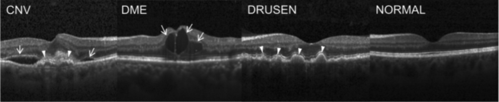
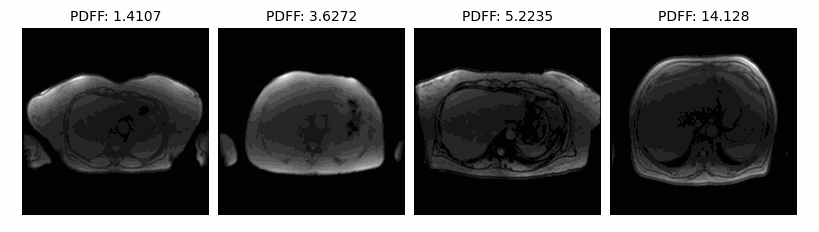
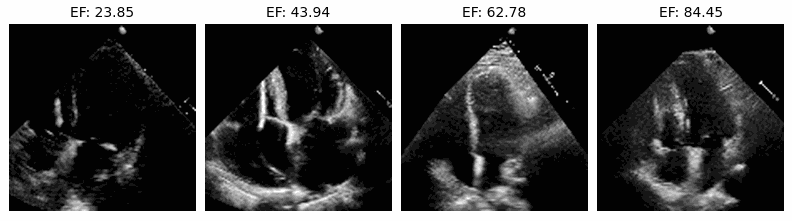

<div align="justify">

# SLIViT: a general AI framework for clinical-feature diagnosis from limited 3D biomedical-imaging data

<br><br><br><br>

SLIViT is a data-efficient deep-learning framework that accurately measures disease-related risk factors in volumetric
biomedical imaging, such as magnetic resonance imaging (MRI) scans, optical coherence tomography (OCT) scans, ultrasound
videos, and Computed Tomography (CT) scans.

SLIViT preprocesses volumes into 2D images and then combines two 2D-based deep-vision architectures: (1) a ConvNeXt
backbone module that extracts a feature map for the slices (i.e., 2D frames of a volume), and (2) a ViT module that
integrates this feature map into a single diagnosis prediction. SLIViT's feature-map extractor is initialized by
pre-trained weights. These weights are obtained by pre-training a ConvNeXt first on ImageNet and then on a 2D
biomedical-imaging dataset. The pre-trained network can be fine-tuned for different diagnostic tasks in
volumetric-biomedical-imaging-data using a relatively small training set (few hundreds of samples).

A step-by-step procedure that includes pre-training, fine-tuning, and evaluating SLIViT is provided, along
with a specific case study using 3D CT volumes (classifying nodule malignancy in the NoduleMNIST dataset).

# Usage instructions

Before using SLIViT, please make sure to have an appropriate conda environment with the relevant packages properly
installed. Pre-trained and fine-tuned models can be downloaded from <a href="https://drive.google.com/drive/folders/1SmmVeGaM7DU2pmLRM-4HVVWb6E8iSwtP?usp=sharing">here.</a> Our model is implemented using PyTorch, and this repository supports PyTorch GPU implementation. 

## Setting up the environment

<!--
### CPU Enviroment

Following instructions will set up a conda enviroment for pre-training using CPUs :


```bash
conda create --name slivit_cpu python=3.8.5
conda activate slivit_cpu
conda install pytorch torchvision cpuonly -c pytorch
```

### GPU Enviroment
-->

Clone the repository and create conda enviroment: 
```bash
git clone https://github.com/berkindurmus/SLIViT
conda create --name slivit python=3.8
```
Activate conda enviroment and install required packages:
```bash
conda activate slivit
conda install pytorch torchvision pytorch-cuda=11.8 -c pytorch -c nvidia
cd SLIViT
pip install -r requirements.txt
```
<a href="https://drive.google.com/drive/folders/1SmmVeGaM7DU2pmLRM-4HVVWb6E8iSwtP?usp=sharing">Download</a> the pre-trained backbone, fine-tuned SLIViT and move the files to the `Checkpoints` folder.

## Backbone Pre-training

### 2D OCT (Kermany)

<h6>(The figure was borrowed from Kermany, et al., 2018 [1])</h6>
<br>

Download the <a href="https://data.mendeley.com/datasets/rscbjbr9sj/3">Kermany dataset</a>
```bash
python bb_train.py --dataset kermany --data_dir /path/to/data --meta_csv ./Dsets/kermany_meta.csv --pathologies Drusen,CNV,DME,Normal --out_dir /output/dir/to/save_pretrained_model/ 
```

### 2D X-ray (ChestMNIST)

<h6>(The figure was borrowed from Wang, et al., 2017 [2])</h6>
<br>

```bash
python bb_train.py --dataset chestmnist --out_dir /output/dir/to/save_pretrained_model/ 
```

### Custom 2D

Supported 2D image formats : `tiff`, `jpeg`, `png`, `bmp`

To commence pre-training with 2D Medical Scans, split the data into `train`, `validation`, `test` sets. Create three
folders named `train`, `val`, `test`, and move the scans accordingly.

Generate the  ```meta.csv``` file for 2D pre-training data as illustrated below:

|F_Name | Path | Pathology-1  |  Pathology-2   |  Pathology-3  | Pathology-4  | 
|--- | --- | --- | --- |--- |--- |
| CNV-6116901-21.jpeg  | /train/CNV/CNV-6116901-21.jpeg| 1.0 | 0.0   |  0.0  |   0.0| 
| DME-4616882-33.jpeg  |   /test/DME/DME-4616882-33.jpeg| 0.0 | 1.0  |   0.0   |  0.0| 
| CNV-7907754-23.jpeg  |  /test/CNV/CNV-7907754-23.jpeg | 1.0 | 0.0   |  0.0    | 0.0| 
| NORMAL-3757443-31.jpeg | /val/NORMAL/NORMAL-3757443-31.jpeg | 0.0  |0.0  |   0.0   |  1.0 |
| NORMAL-6434323-2.jpeg |  /train/NORMAL/NORMAL-6434323-2.jpeg  |0.0|  0.0   |  0.0 |    1.0|
| NORMAL-910422-8.jpeg | /val/NORMAL/NORMAL-910422-8.jpeg | 0.0 | 0.0  |   0.0   |  1.0|
| DRUSEN-8086850-28.jpeg | /train/DRUSEN/DRUSEN-8086850-28.jpeg | 0.0 | 0.0   |  1.0   |  0.0|

In the above table, `F_Name` denotes the file name for 2D medical scan files, `Path` indicates the directory to these
files, and `Pathology-1`, `Pathology-2`, `Pathology-3`, and `Pathology-4` represent binary classes for the respective
pathologies.

After creating ```meta.csv``` file, ConvNeXt backbone can be trained with following bash script:

```bash
python bb_train.py --dataset custom --meta_csv /path/to/meta.csv --pathologies Pathology-1,Pathology-2,Pathology-3,Pathology-4 --out_dir /output/dir/to/save_pretrained_model/ --b_size 16 --gpu_id 0 --n_cpu=32
```

- ```--dataset``` is the dataset for pre-training (`kermany`, `chestmnist`, `custom` ) 
- ```--data_dir``` is the root directory for the created `train`, `validation`, `test` set folders.
- ```--meta_csv``` is the directory to the created ```meta.csv```.
- ```--pathologies``` is a comma-separated list of pathologies for pre-training.
- ```--out_dir```  is the output directory for saving the pre-trained backbone.
- ```--b_size``` denotes the batch size for training.
- ```--gpu_id``` specifies the GPU ID for training.
- ```--n_cpu``` indicates the number of CPUs for data loading.
- ```--n_epochs``` indicates the number of epochs to train.
- ```--patience``` is the number of epochs to await without improvement before initiating early stopping


## Fine-tuning

### 3D CT (NoduleMNIST)
<br>

```bash
python slivit_train.py --dataset3d nodulemnist --task classification --bbpath /path/to/pretrained/convnext_bb_kermany.pth --nObb_feat 4 --nslc 28 --depth 5 --dim 64 --heads 10 --out_dir /output/dir/to/save_finetuned_slivit/ 
```
### 3D MRI (UKBB)
<br>
The UKBB MRI dataset available <a href="https://www.ukbiobank.ac.uk">here</a>. After downloading the data, replace the paths in  `./Dsets/ukbb_meta.csv` with corresponding paths to the downloaded scans.

```bash
python slivit_train.py --dataset3d ukbb --meta_csv ./Dsets/ukbb_meta.csv --task regression --bbpath ./Checkpoints/convnext_bb_kermany.pth --nObb_feat 4 --depth 5 --dim 256 --nslc 36 --heads 36 --out_dir /output/dir/to/save_finetuned_slivit/ 
```
### Ultrasound Videos (EchoNet)
<br>
The EchoNet Ultrasound videos are available <a href="https://stanfordaimi.azurewebsites.net/datasets/834e1cd1-92f7-4268-9daa-d359198b310a">here</a>. After downloading the data, replace the paths in  `./Dsets/ultrasound_meta.csv` with corresponding paths to the downloaded videos.
```bash
python slivit_train.py --dataset3d ultrasound --meta_csv ./Dsets/ultrasound_meta.csv --bbpath ./Checkpoints/convnext_bb_kermany.pth --nObb_feat 4 --nslc 32 --depth 5 --dim 256 --heads 32
```
### Custom 3D

Supported 3D volume formats : 2D slice files as `tiff` or  `dcm`

Generate the  ```meta.csv``` file for 3D fine-tuning data as illustrated below:

|pid | path | Pathology  | Split | 
| --- | --- | --- | ---  |
| 1754715 | /scratch/avram/MRI/liver/dcm/with_annotations/5628597 | 1.4107 | train | 
| 4501528 | /scratch/avram/MRI/liver/dcm/with_annotations/4501528 | 3.6272 | valid | 
| 2161445 | /scratch/avram/MRI/liver/dcm/with_annotations/2161445 | 14.128 | valid | 
| 5364532 | /scratch/avram/MRI/liver/dcm/with_annotations/5364532 | 1.3523 | train |
| 2653392 | /scratch/avram/MRI/liver/dcm/with_annotations/2653392 | 2.6253 | test  |
| 1754715 | /scratch/avram/MRI/liver/dcm/with_annotations/1754715 | 5.2235 | train |
| 4986672 | /scratch/avram/MRI/liver/dcm/with_annotations/4986672 | 3.1356 | test  |

In the above table, `pid` denotes the unique patient ID  for 3D medical volume, `Path` indicates the directory to folder which contains 2D slice files for the correspoding volume, and `Pathology` represent pathology score or binary pathology class.

After creating ```meta.csv``` file, SLIViT can be fine tuned with following bash script:

```bash
python slivit_train.py --dataset3d custom --meta_csv /path/to/generated/meta.csv --bbpath /path/to/pretrained/convnext_bb.pth --task regression --pathology Pathology --out_dir /output/dir/to/save_pretrained_model/ 
```

- ```--dataset3d``` is the dataset for 3D fine-tuning (`nodulemnist`, `ukbb`, `ultrasound`,`custom3d` ) 
- ```--meta_csv``` is the path to the created ```meta.csv``` file
- ```--pathology``` is pathology for 3D fine-tuning
- ```--bbpath``` is the path to pre-rained ConvNeXt backbone
- ```--nObb_feat``` is the number of classes the backbone was pre-trained on ( Kermany: `4` , ChestMNIST: `14` )
- ```--task``` is the 3D Fine-tuning task (classification or regression)
- ```--nslc``` is the number of slices to use for 3D Fine-tuning
- ```--depth``` is the Vision Transformer depth
- ```--heads``` is the number of heads for multihead attention
- ```--dim``` specifies the dimension for encoding transformer input
- ```--mlp_dim``` denotes the multi-layer perceptron dimension for ViT
- ```--dropout``` is the dropout rate
- ```--emb_dropout``` is the embeding dropout rate
- ```--patience``` is the number of epochs to await without improvement before initiating early stopping


## Evaluating
### Nodule MNIST
```bash
python slivit_test.py --dataset3d nodulemnist --checkpoint ./Checkpoints/slivit_noduleMNIST --depth 5 --dim 64 --nslc 28 --mlp_dim 64 --heads 10
```
### UKBB

```bash
python slivit_test.py --dataset3d ukbb --meta_csv ./Dsets/ukbb_meta.csv --checkpoint ./Checkpoints/slivit_ukbb --metric r2 --pathology PDFF --depth 5 --dim 256 --nslc 36 --heads 36
```
### Ultrasound

```bash
python slivit_test.py --dataset3d ultrasound --meta_csv ./Dsets/ultrasound_meta.csv --checkpoint ./Checkpoints/slivit_ultrasound --pathology EF_b --depth 5 --dim 256 --nslc 32 --heads 32 --mlp_dim 256
```

- ```--dataset3d``` is the dataset for 3D fine-tuning ( `nodulemnist`, `ukbb`, `ultrasound` ,`custom3d` ) 
- ```--meta_csv``` is the path to the created ```meta.csv``` file
- ```--pathology``` is pathology for 3D fine-tuning
- ```--nObb_feat``` is the number of classes the backbone was pre-trained on ( Kermany: `4` , ChestMNIST: `14` )
- ```--task``` is the 3D Fine-tuning task (classification or regression)
- ```--metric``` is the score metric for evaluation ( `roc-auc`, `pr-auc`, `r2` ) 
- ```--checkpoint``` is the path to fine-tuned slivit
- ```--nslc``` is the number of slices to use for 3D Fine-tuning
- ```--depth``` is the Vision Transformer depth
- ```--heads``` is the number of heads for multihead attention
- ```--dim``` specifies the dimension for encoding transformer input
- ```--mlp_dim``` denotes the multi-layer perceptron dimension for ViT


Please refer to <a href="https://www.researchsquare.com/article/rs-3044914/latest">our manuscript</a> for further
details and feel free to <a href="mailto:orenavram@gmail.com,berkin1997@g.ucla.edu?subject=A%20SLIViT%20question"> reach
out</a> regarding any concerns/issues you are experiencing with SLIViT.

## Data Availability

The 2D OCT dataset was downloaded from https://www.kaggle.com/datasets/paultimothymooney/kermany2018. The 3D OCT B-scan
data are not publicly available due to institutional data use policy and concerns about patient privacy. However, they
are available from the authors upon reasonable request and with permission of the institutional review board. The
echocardiogram dataset is available at https://echonet.github.io/dynamic/index.html#dataset. The MRI dataset is
available at https://www.ukbiobank.ac.uk. The 3D CT, the 2D CT, and the 2D X-ray datasets are available
at https://medmnist.com/.

## Credits

We kindly request users to cite the corresponding paper upon using our code, checkpoints, or conclusions in any
capacity. Proper credit supports and recognizes the original creators' efforts.

```
@article{avram2023slivit,
  title={SLIViT: a general AI framework for clinical-feature diagnosis from limited 3D biomedical-imaging data},
  author={Avram, Oren and others},
  journal={InReview preprint https://www.researchsquare.com/article/rs-3044914/latest},
  year={2023}
}
```

## Acknowledgement

Parts of the code are taken from the <a href="https://github.com/lucidrains/vit-pytorch/tree/main"> vit-pytorch</a>
repository. The figures depicting Kermany and the X-ray dataset are sourced from [1] and [2] respectively.
## References

[1] Kermany DS, Goldbaum M, Cai W, Valentim CCS, Liang H, Baxter SL, McKeown A, Yang G, Wu X, Yan F, Dong J, Prasadha MK, Pei J, Ting MYL, Zhu J, Li C, Hewett S, Dong J, Ziyar I, Shi A, Zhang R, Zheng L, Hou R, Shi W, Fu X, Duan Y, Huu VAN, Wen C, Zhang ED, Zhang CL, Li O, Wang X, Singer MA, Sun X, Xu J, Tafreshi A, Lewis MA, Xia H, Zhang K. Identifying Medical Diagnoses and Treatable Diseases by Image-Based Deep Learning. Cell. 2018 Feb 22;172(5):1122-1131.e9. doi: 10.1016/j.cell.2018.02.010. PMID: 29474911.

[2] Wang, X., Peng, Y., Lu, L., Lu, Z., Bagheri, M., & Summers, R. (2017). ChestX-Ray8: Hospital-Scale Chest X-Ray Database and Benchmarks on Weakly-Supervised Classification and Localization of Common Thorax Diseases. In 2017 IEEE Conference on Computer Vision and Pattern Recognition (CVPR). IEEE.
</div>
